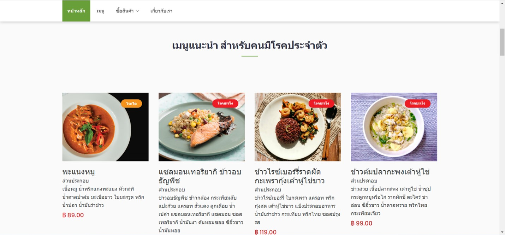
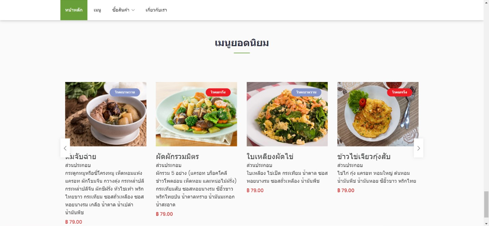
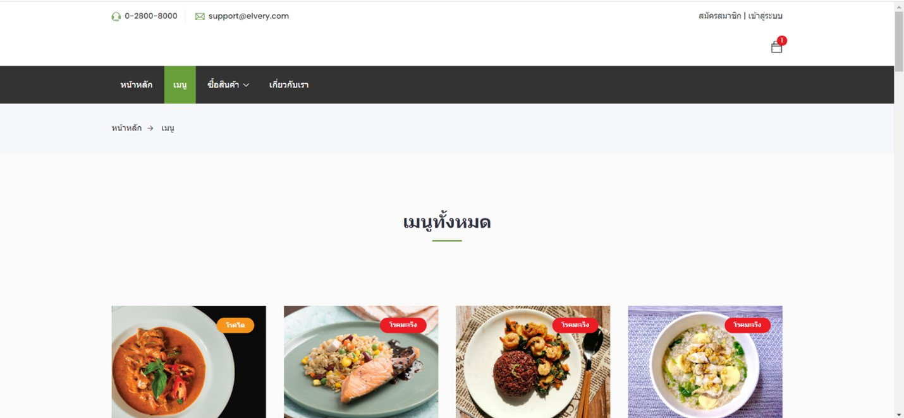
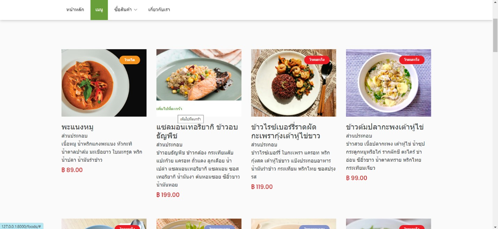
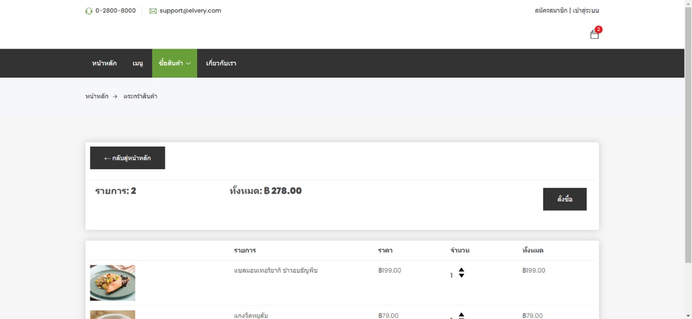
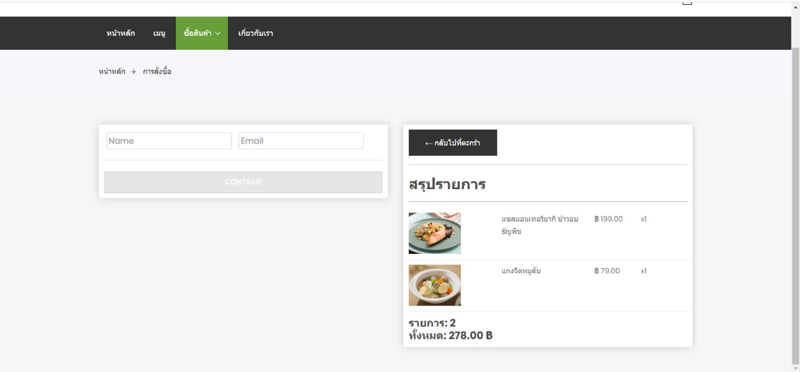
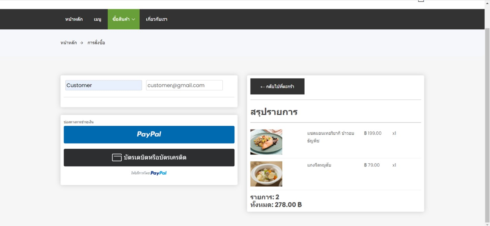
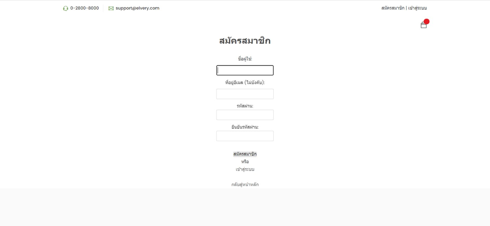
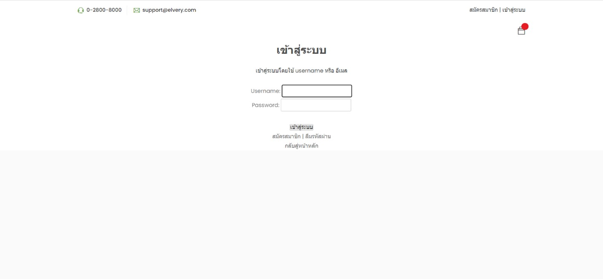

# ELVERY Project
Worked on the project of ELVERY in web application for Software Engineering course

# Introduction
A web application for ordering meals that is appropriate for the elderly and those with underlying medical conditions, which was developed using Python Django with SQLite3 for the database and HTML, CSS, and JavaScript for the user interface.
 
# Project background and scope
The current situation of the elderly in Thailand tends to be more advanced, and it is found that most of the elderly in Thailand have the disease. Common ones include kidney disease, cancer, diabetes, and high blood pressure. The authors foreseen this problem and therefore created the ELVERY web-application for ordering food suitable for the elderly and people with underlying diseases due to food being Factors that are important and affect both the health and life of the elderly as they get older The physical condition is there. Change and food choices are therefore important. must therefore promote and take proper care. This software is a platform. a web-application consisting of 4 groups of users: the elderly, those with congenital disease, elderly caregivers or people with congenital disease, and general people who are interested in eating healthy food, which users can access and use various functions. to facilitate the selection of food quickly and appropriately.

Scope
1. User registration and login
2. Browse product list
3. Adding products to the cart
4. Order
5. Payment

# Problem Definition
Functional Requirements 
1. The system must allow the user to view the entire menu. Both registered and unregistered users can view the entire menu. View details of food menus, such as ingredients, prices, and food suitability for patients with various congenital diseases, and can order 
2. The system must allow the user to register. 
3. The system must allow the user to register and log in.
4. The system must allow the logged-in user to view their profile and edit their personal information. 
5. The system must enable the user to add food menus to the cart. 
6. The system must allow the user to Orders and payments can be made via PayPal and credit card. debit 
7. The system must allow the user to enter the shipping address when placing an order.

# Use Case Diagram

# User Interface

  

  

  

  

  

  

  

  

  

  

